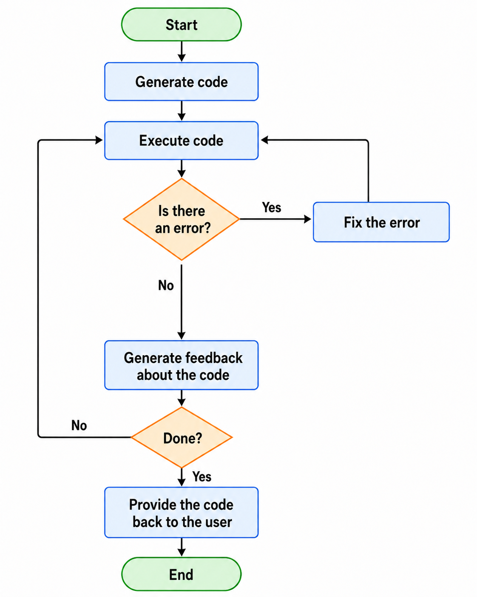
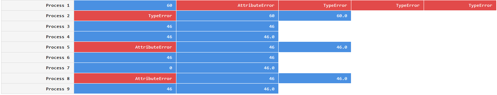
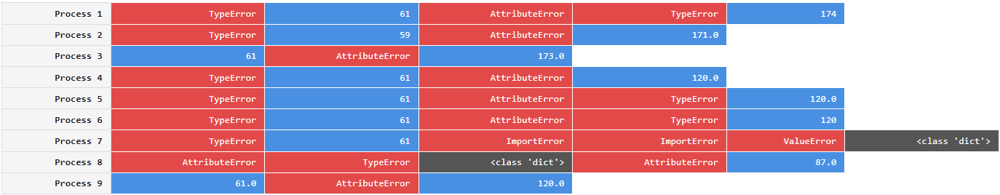

# Sand-Bob

A framework for studying language models and prompt-engineering performance in the context of  single-script code generation for data analysis. sand-bob allows you to
* generate code in parallel and sequentially using the same prompt 
* fix errors in code automatically iteratively
* study code execution results with defined statistical power
* do prompt engineering properly
* compare language models


Note: This is research software under active development. The API may break with every new release.

## Features

- Python code generation using LLMs
- Execute Python code in isolated Docker containers
- Automatic detection of missing dependencies
- Automatic fixing of code errors
- Automatic generation and incorporation of code feedback
- Convenient display in Jupyter
- Code export as Jupyter Notebooks

## Installation

```bash
pip install sand-bob
```

Additionally, you need a local [docker](https://docs.docker.com/engine/install/) installation.

## Basic usage

Before you can start prompting for code, you need to configure the environment where the AI-generate code can be executed and what files it will have [read] access to.

```
from sand_bob import initialize, config_ollama, generate_code

config_ollama(model="gpt-oss:20b", vision_model="gemma3:12b")

initialize(input_host_path="input_data/", 
           n_parallel=1, 
           n_iterative=1,
           n_codefix_attempts=2, 
           n_feedback_iterations=1,
           dependencies=["numpy", "matplotlib", "pandas", "scikit-image", "seaborn", "stackview", "scipy"])
```

You can then prompt for data analysis code like this:

```
%%alice
There is an image input_data/blobs.tif 
I would like to segment  the bright blobs in the image and count them.
The result should be the number of blobs
```

Or alternatively both steps above in one shot:
```
results = generate_code("""
There is an image input_data/blobs.tif 
I would like to segment  the bright blobs in the image and count them.
The result should be the number of blobs
""",
   input_host_path="input_data/", 
   dependencies=["numpy", "matplotlib", "pandas", "scikit-image", "seaborn", "stackview", "scipy"],
   n_parallel=2, 
   n_iterative=3, 
   n_feedback_iterations=1, 
   n_codefix_attempts=1)

results
```

Note that in your prompt, you need to specify the final result format you expect. Otherwise it will be hard later to decide which of multiple generated code samples do the right job.

After retrieving the `results`, you can also navigate through them:

```
for i, r in enumerate(results):
    print(f"Execution {i} had result", r)
```

### Parameters

* `model`: A large language model (LLM) capable of code-generation. When using [Ollama](https://ollama.com), you should install it first and download the model. 

* `vision_model`: A vision language model (VLM) that can interpret plots and data visualizations used for generating  feedback about code and resulting data visualizations. If you do not have access to any VLM, you need to specify `n_feedback_iterations=0`.

* `input_host_path`: This folder location will be accessible to the docker container where the code will be executed. It is recommended for now to make a subfolder named "input_data" and put the data you want to work with in this folder. Later in the prompt, you can mention this folder "input_data" to point the AI at specific files.

* `n_parallel` and `n_iterative`: Code generation can be done multiple times in parallel and iteratively, e.g. if you specify `n_parallel=2` and `n_iterative=3`, two threads will start a docker container each, run and optimize code. They will do it both 3 times each. By the end you will receive 6 code samples that attempt to solve your data analysis task, together with corresponding results.

* `n_codefix_attempts`: If there was an error after code was generated and executed, the AI will attempt to fix this error multiple times as specified. E.g. if `n_codefix_attempts=2`, code will be executed 1 time in the best case and 3 times in the worst case. Code fixing also includes potentially updating the list of dependencies. Only libraries listed in `sand_bob.WHITELIST_DEPENDENCIES`. You can also modify this list to your needs before executing code generation.

* `n_feedback_iterations`: After potential code-fixes, the code and corresponding result  visualizations will be provided to a VLM to check it. This VLM will potentially come up with code improvements. Improved code will then be fed back to code-fixing if necessary. If  the  code remains identical, e.g. because  feedback suggested so, it will  stop early. Hence, if you specify `n_codefix_attempts=2` and `n_feedback_iterations=2`, code will be executed 1 time in the best case and 9 times in the worst case.

This figure explains how `n_codefix_attempts` and `n_feedback_iterations` work together:



### Prompting for Python Code

If you do not provide number of parallel or  iterative executions, only one result will be produced.

```python
from sand_bob import generate_code

result = generate_code(
    prompt="Count the number of 'b's in blueberry.",
    dependencies=[]
)
print(result.final_result)
print(result.code)
```

### GPU support

```python
from sand_bob import execute

code = """
import cupy as cp

device_id = cp.cuda.runtime.getDevice()
props = cp.cuda.runtime.getDeviceProperties(device_id)

print(f"Current CUDA device ID: {device_id}")
print(f"Current CUDA device name: {props['name'].decode()}")
"""

execute(code, dependencies=["cupy"], gpu_support=True)
```

### Errors in code

```python
from sand_bob import execute

code = """
import nonexistent_module
print("This won't execute")
"""

result = execute(code, dependencies=[])
print(result.stdout)
```

### Result  tracing

During the process of code improvement, error messages and results are stored. You can visualize them to differentiate cases, where finding a solution was straight-forward:



... and cases where the system struggled to solve a task:




Note that even if multiple code generations / executions return the same result, does not necessarily mean the result is correct.

## Examples

Check out the `examples/` directory for more detailed examples.

## Requirements

- Docker
- Docker Compose
- Python 3.8+

## Similar Projects

* [SandboxAI](https://github.com/substratusai/sandboxai)


## License

BSD-3 License 